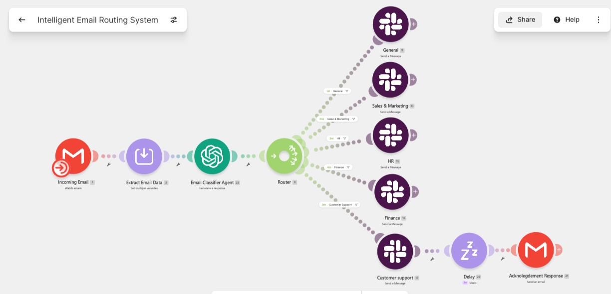

# Intelligent Email Routing System

AI-powered email routing system that classifies, prioritizes, routes incoming emails to the appropriate department, and automates customer acknowledgements

## Tech Stack

- Make.com
- Gmail API
- OpenAI GPT-4.1 Mini
- Slack API

---

## Overview

Businesses often receive sales inquiries, support requests, HR questions, and finance-related emails through a shared inbox. This project automates the entire email triage process by using AI to classify, prioritize, and route incoming emails while generating professional acknowledgement responses for customer support inquiries.
---
## Project Highlights

- 🤖 AI-powered email classification using GPT-4.1 Mini
- 🚦 Intelligent priority assignment (High, Medium, Low)
- 📬 Automated routing to department-specific Slack channels
- ✉️ AI-generated customer acknowledgement emails
- 🛡️ Structured JSON outputs for reliable workflow automation
- ⚡ Built with Make.com for scalable, low-code orchestration
## Features

- 📧 Monitors a Gmail inbox for new emails.
- 🤖 Uses GPT-4.1 Mini to classify incoming emails.
- 🚦 Assigns High, Medium, or Low priority.
- 📝 Generates concise AI summaries.
- 💬 Routes emails to the appropriate Slack channel.
- ✉️ Drafts acknowledgement emails for Customer Support.
- ⏱️ Delays automated responses for a more natural customer experience.
- 🛡️ Uses structured JSON outputs for reliable automation.
---

## Workflow



*Complete workflow illustrating email ingestion, AI classification, intelligent routing, Slack notifications, and automated customer acknowledgements.*
## Demo

| Incoming Email | AI Processing | Result |
|----------------|--------------|--------|
| Gmail receives a new email | AI classifies the department, assigns priority, and generates a summary | Email is routed to the correct Slack channel and customer support receives an automated acknowledgement when applicable |
---

## Make Blueprint

The exported Make.com scenario blueprint is included in this repository for reference and can be imported directly into Make after configuring the required connections and API credentials.

**Blueprint Location:**

```text
make/Intelligent Email Routing System.blueprint.json
```

> **Note:** API keys, OAuth connections, and other sensitive credentials are **not** included in the exported blueprint and must be configured after importing the scenario.
